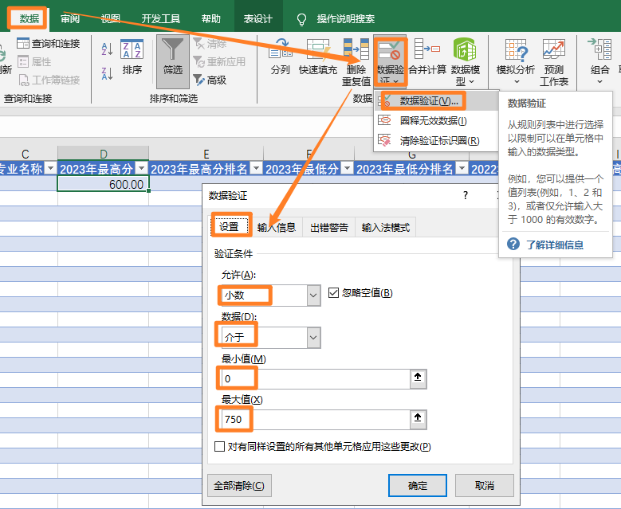
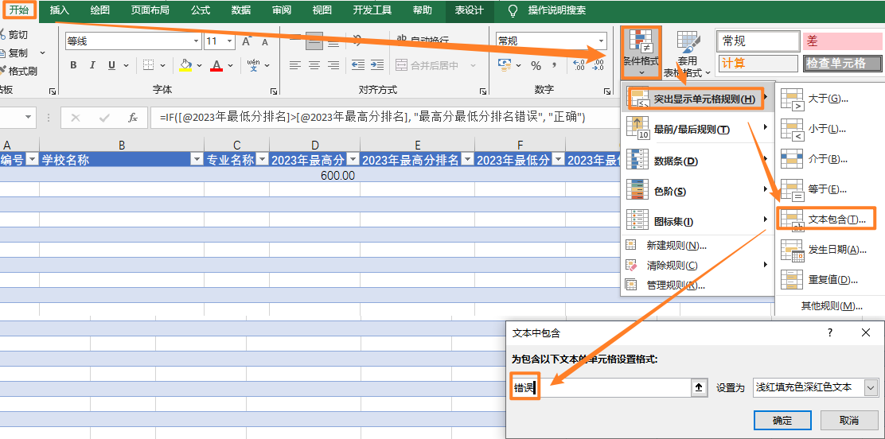

## 1. Excel 中，某一单元格只能是4位数字，可能是“0001”，如何设置条件格式

### 1.1 设置单元格只能输入4位数字（包括前导零）
1. **选择单元格或单元格区域**  
   选择你希望设置的单元格或单元格区域。

2. **设置单元格格式为“文本”**  
   右键点击选中的单元格，选择“设置单元格格式”（Format Cells），在“数字”（Number）选项卡中选择“文本”（Text）。这样可以确保输入的数字会保留前导零。

3. **打开数据验证设置**  
   在菜单栏中，点击“数据”（Data）选项卡，然后选择“数据验证”（Data Validation）。

4. **设置验证条件**  
   在“数据验证”对话框中，选择“设置”（Settings）选项卡。  
   - 在“允许”（Allow）下拉菜单中，选择“自定义”（Custom）。  
   - 在“公式”（Formula）框中输入以下公式：  
     ```excel
     =AND(ISNUMBER(VALUE(TRIM(A1))), LEN(A1)=4)
     ```
     这里的 `A1` 是你的目标单元格，你可以根据实际情况修改为其他单元格引用。

5. **设置输入提示和错误警告（可选）**  
   - 切换到“输入信息”（Input Message）选项卡，输入提示信息，例如：“请输入4位数字（如0001）”。  
   - 切换到“错误警告”（Error Alert）选项卡，选择“停止”（Stop），并输入错误提示信息，例如：“输入无效，请输入4位数字（如0001）”。

6. **完成设置**  
   点击“确定”完成设置。

### 1.2 示例说明
- **公式解释**：  
  - `TRIM(A1)`：去除单元格中的多余空格。  
  - `VALUE(TRIM(A1))`：将文本转换为数字。  
  - `ISNUMBER(VALUE(TRIM(A1)))`：检查单元格内容是否为数字。  
  - `LEN(A1)=4`：检查单元格内容是否为4位字符。

## 2. Excel 中，某一单元格不能有空格，不能有英文括号，如何设置条件格式

在Excel中，如果需要限制单元格中不能包含空格或英文括号（如`()`），可以通过**数据验证（Data Validation）**功能实现，而不是条件格式（Conditional Formatting）。条件格式主要用于根据单元格内容显示不同的格式，而数据验证可以限制用户输入的内容。

以下是通过数据验证限制单元格中不能包含空格和英文括号的步骤：

### 2.1 设置单元格不能包含空格和英文括号
1. **选择单元格或单元格区域**  
   选择你希望设置的单元格或单元格区域。

2. **打开数据验证设置**  
   在菜单栏中，点击“数据”（Data）选项卡，然后选择“数据验证”（Data Validation）。

3. **设置验证条件**  
   在“数据验证”对话框中，选择“设置”（Settings）选项卡。  
   - 在“允许”（Allow）下拉菜单中，选择“自定义”（Custom）。  
   - 在“公式”（Formula）框中输入以下公式：  
     ```excel
     =AND(ISERROR(SEARCH(" ", A1)), ISERROR(SEARCH("(", A1)), ISERROR(SEARCH(")", A1)))
     ```
     这里的`A1`是你的目标单元格，你可以根据实际情况修改为其他单元格引用。

4. **设置输入提示和错误警告（可选）**  
   - 切换到“输入信息”（Input Message）选项卡，输入提示信息，例如：“请输入不包含空格和英文括号的内容”。  
   - 切换到“错误警告”（Error Alert）选项卡，选择“停止”（Stop），并输入错误提示信息，例如：“输入无效，请不要包含空格或英文括号（(）和）”。

5. **完成设置**  
   点击“确定”完成设置。

### 2.2 公式解释
- `SEARCH(" ", A1)`：在单元格内容中查找空格。如果找到，返回该字符的位置；如果未找到，返回错误。
- `ISERROR(SEARCH(" ", A1))`：检查是否未找到空格，返回`TRUE`表示未找到。
- `ISERROR(SEARCH("(", A1))`和`ISERROR(SEARCH(")", A1))`：分别检查是否未找到左括号和右括号。
- `AND(...)`：确保所有条件都为`TRUE`，即单元格中既没有空格，也没有英文括号。

## 3. 某单元格只能是 0 到 750 之间的小数
数据-数据工具-数据验证-设置-小数-介于-0-750


## 4. 通过函数和条件格式搭配，实现多个单元格关系的校验
1. 函数“=IF([@2023年最低分]>[@2023年最高分], "最高分最低分错误", "正确")”。

2. 设置条件格式：开始-格式-条件格式-突出显示单元格规则-文本包含-错误
   
