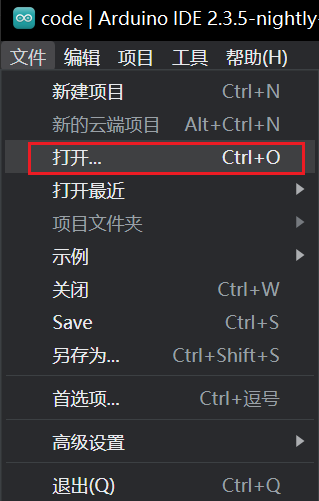
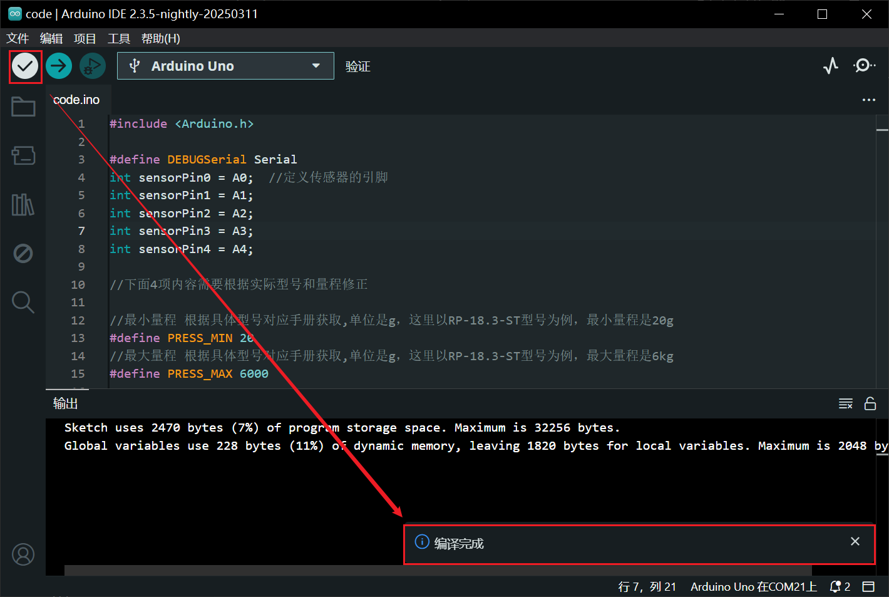
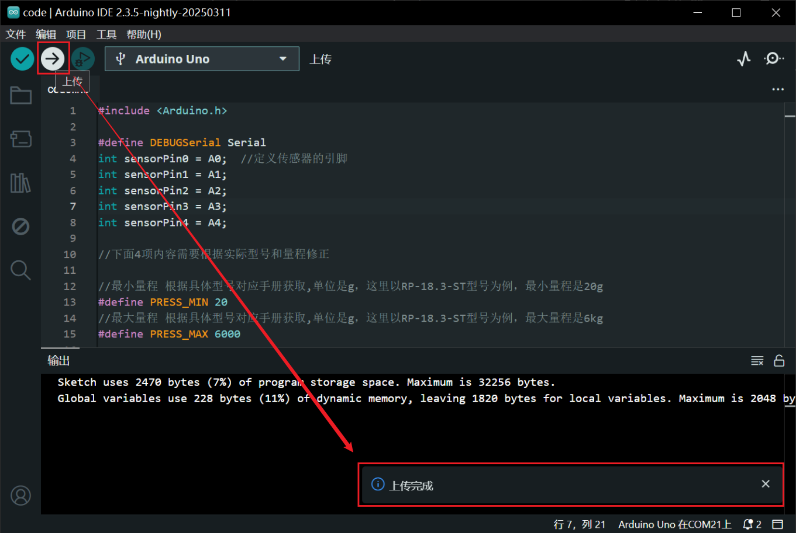

## 1. 前言
最近使用的一个采集板需要通过 Arduino 才能使用串口接收数据。于是学习了 Arduino 的基本使用，此博客记录一些基础操作。

## 2. 烧录
1. 文件-打开。
    
    
2. 选择一个 ino 文件，注意 ino 文件所在的文件夹名应为“code”。
3. 编译（左上角对号），右下角会出现“编译完成”。
    
    
4. 烧录（左上角右箭头），右下角会出现“上传完成”。如果烧录失败，拔掉开发板上的**所有**杜邦线再次尝试。（即使杜邦线的另一端没有连接任何器件也可能会报错）
    
    
