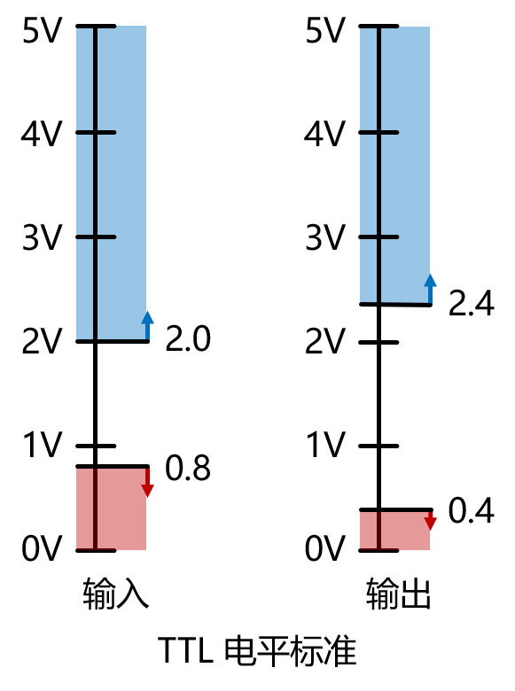
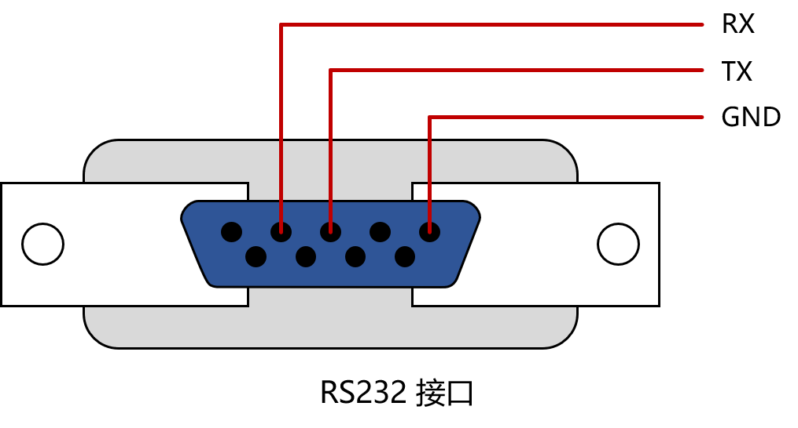
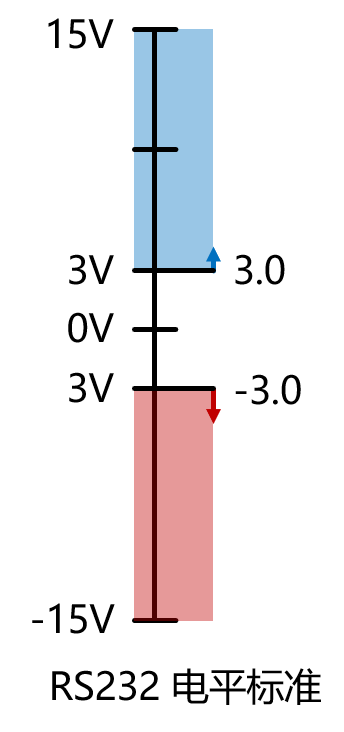
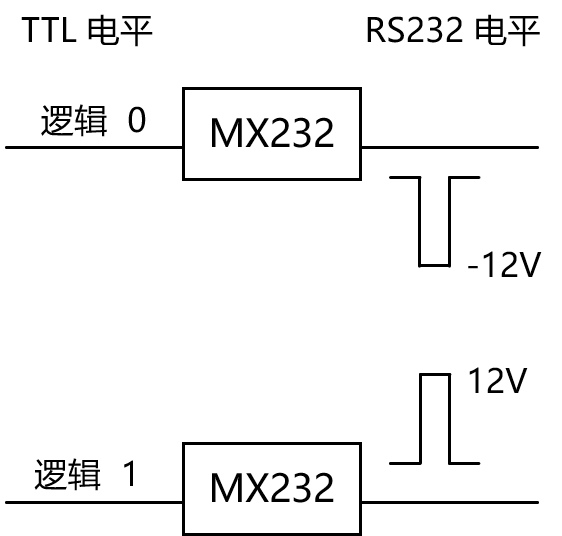
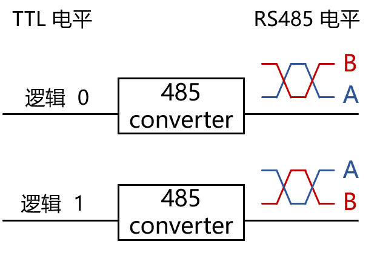

## 前言
最近的项目中接触到了 RS485。

## 相关定义

**串口**（Serial port）是一种通信方式，即串行接口，也称串行端口，COM接口。与并口相对。

**电气标准**包括 TTL、RS-232-C、RS-422、RS485、USB 等。

**波特率**：9600 代表 1 秒内可传输 9600 个高低电平。

## TTL（Transistor-Transistor Logic）
1. 输入电压准位
   - Hi输入电压：2.0V以上；
   - Low输入电压：0.8V以下。
2. 输出电压准位
   - Hi输出电压：2.4V以上；
   - Low输出电压：0.4V以下。

{: width="300"}

前一级输出至次一级输入电压准位间，可以容忍的噪声边际电压是0.4V。

- 全双工通讯，只能点对点通讯。
- 抗干扰能力弱。
- 通信距离短（1m）。

## RS232（Recommended Standard 232）
{: width="500"}

在 RS-232 标准中定义了逻辑一和逻辑零电压级数。信号大小在正的和负的 3－15v 之间。RS-232 规定逻辑一规定为负电平，逻辑零规定为正电平。电平有效范围在 ±3V 至 ±15V之间。根据设备供电电源的不同，±5V、±10V、±12V 和 ±15V 这样的电平都是可能的。

{: width="170"}

可使用电平转换芯片（如 MX232）将 TTL 电平转换为 232 电平。
以 12V 的电源，输入逻辑 0 和输入逻辑 1 为例。反向同理。

{: width="300"}

- 全双工通讯，只能点对点通讯。
- 抗干扰能力强。
- 通信距离长（15m）。
- 传输频率（2M）。

## RS485（Recommended Standard 485）
使用缠绕的双绞线传输信号，抗干扰能力很强。485 可以不接地，完全不影响传输，除非环境干扰特别强。
使用电平转换芯片将 TTL 电平转换为 485 电平，输出差分信号。

{: width="300"}

- 半双工通讯，可以实现一主多从通讯。
- 抗干扰能力很强。
- 通信距离很长（1200m）。
- 传输频率高（50M）

## References
[B站-5分钟看懂!串口RS232 RS485最本质的区别！](https://www.bilibili.com/video/BV1PD4y147ts/?share_source=copy_web&vd_source=54da364394d3171749b2e716a4ee75dd)
[维基百科-串行接口](https://zh.wikipedia.org/wiki/%E4%B8%B2%E8%A1%8C%E7%AB%AF%E5%8F%A3)
[维基百科-晶体管-晶体管逻辑](https://zh.wikipedia.org/wiki/%E9%9B%BB%E6%99%B6%E9%AB%94-%E9%9B%BB%E6%99%B6%E9%AB%94%E9%82%8F%E8%BC%AF)
[维基百科-RS-232](https://zh.wikipedia.org/wiki/RS-232)
[维基百科-EIA-485](https://zh.wikipedia.org/wiki/EIA-485)
