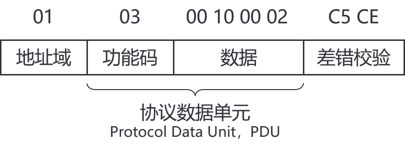
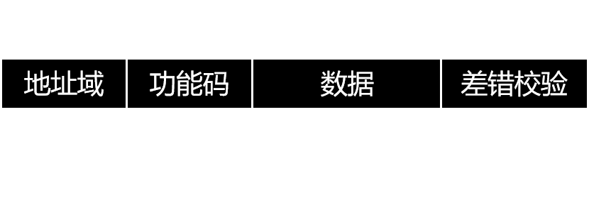
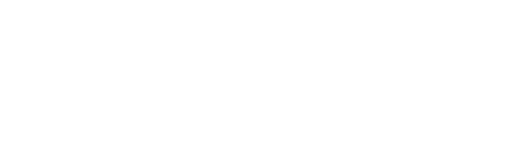
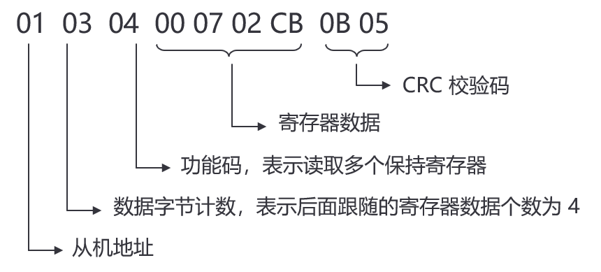
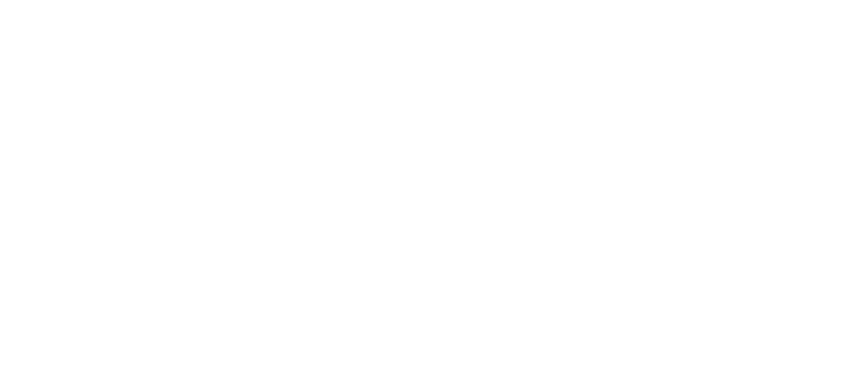

## 1 前言
现在使用的某块板子用到了 Modbus-RTU 协议，于是学习了以一下。本篇博客对 Modbus-RTU 做一些基本的介绍。

## 2 初识

Modbus 协议是一个 master/slave 架构的协议。有一个节点是 master 节点，其他是 slave 节点。每一个 slave 设备都有一个唯一的地址。

Modbus 协议分为 Modbus-RTU，Modbus-ASCII，Modbus-TCP。一般来说一个设备只有其中一种协议。而且 Modbus 规定，Modbus-RTU 是设备必须支持的协议，也是默认选项。所以大多是设备都采用了 Modbus-RTU 协议通讯。

基本的 ModBus 命令能指挥一个子节点改变它的寄存器的某个值，控制或者读取一个 I/O 端口，以及指挥设备回送一个或者多个其寄存器中的数据。

## 3 帧结构
帧结构由地址域、功能码、数据、差错校验组成。

{: .light width="400"}
{: .dark width="400"}

### 3.1 地址域
地址域由一个字节构成（8 位），理论上有 256 中不同的地址域。但不能一个主站搭配 265 个从站设备，因为地址 0 是广播地址，后 8 个地址（248 ~ 255）是被保留的，所以只有中间的 1 ~ 247 可以作为从站地址。被保留的地址可以有用户自由设定，例如设定特定地址段的广播指令。

根据地址域的不同，分为广播与单播模式。

    - 单播：master 发出的一个 ModBus 命令包含了目标从站的 Modbus 地址，所有设备都会收到命令，但只有指定位置的设备会执行及回应指令，在等待从节点响应时会启动响应超时机制，此为单播。单播时，一个事务由两个报文组成：请求报文和应答报文。
    - 广播：当地址为 0 时，证明这是一个广播指令，所有收到指令的设备都会执行，但不回应指令。

同一时刻主节点只会发起一个 Modbus 事务处理。子节点不会主动发送数据，子节点间也不会相互通信。

### 3.2 PDU
PDU 由功能码和数据组成。

{: .light width="400"}
{: .dark width="400"}

### 3.3 功能码
功能码由一个字节构成。

### 3.4 数据
数据长度不定，由功能码决定。

### 3.5 回执帧
{: .light width="400"}
{: .dark width="400"}

## 4 Modbus-RTU CRC 程序
```python
import serial
import time
import matplotlib.pyplot as plt
from threading import Thread, Event

# 计算 MODBUS CRC-16 校验码
def calculate_crc(data):
    crc = 0xFFFF
    for byte in data:
        crc ^= byte
        for _ in range(8):
            if crc & 0x0001:
                crc >>= 1
                crc ^= 0xA001
            else:
                crc >>= 1
    return crc.to_bytes(2, byteorder='little')  # 返回2字节，低字节在前
``` 

## 5 References
1. [维基百科-Modbus](https://zh.wikipedia.org/wiki/Modbus)
2. [B站-Modbus RTU 协议讲解](https://www.bilibili.com/video/BV1Qr4y1M7oE/?share_source=copy_web&vd_source=54da364394d3171749b2e716a4ee75dd)
3. [CSDN-大神带你秒懂Modbus通信协议](https://blog.csdn.net/tiandiren111/article/details/118347661)
