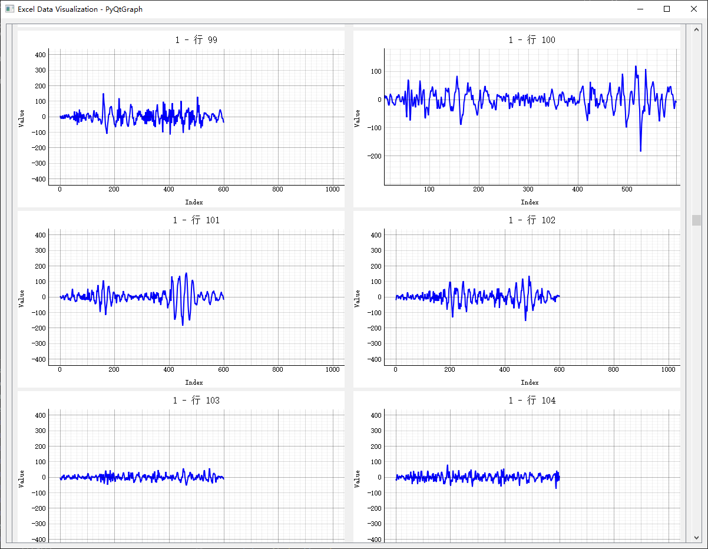

# 1. 前言

最近经常处理 Excel 数据，为了方便地观察数据写了一个可视化工具。

此程序会读取指定的 Excel 文件中的每一个 Sheet 的每一行数据，并以折线图的形式展示出来。

# 2. Code
```sh
python tools\excel_chart_viewer.py data\real_data_sheet_cls_5_artificial_cut.xlsx
```



```python
# 3. 25 Y
# 4. 50 AX
# 5. 75 BW1
# 6. 100 CV
# 7. 200 GR
# 8. 400 OJ
# 9. 500 SF
# 10. 550 UD
# 11. 600 WB

import sys
import os
import warnings
import pandas as pd
import numpy as np
from PyQt5.QtWidgets import (QApplication, QMainWindow, QWidget, QVBoxLayout, 
                             QScrollArea, QHBoxLayout, QLabel, QFrame)
from PyQt5.QtCore import Qt
import pyqtgraph as pg

# 12. 抑制警告输出
class NullWriter:
    def write(self, s):
        pass

original_stderr = sys.stderr
sys.stderr = NullWriter()
warnings.filterwarnings("ignore")

class ExcelChartViewer(QMainWindow):
    def __init__(self, excel_path, charts_per_row=2, y_range=None, x_range=None):
        super().__init__()
        self.excel_path = excel_path
        self.charts_per_row = charts_per_row
        self.y_range = y_range
        self.x_range = x_range
        self.setWindowTitle("Excel Data Visualization - PyQtGraph")
        self.setGeometry(100, 100, 1200, 900)
        
        # 设置PyQtGraph样式
        pg.setConfigOption('background', 'w')
        pg.setConfigOption('foreground', 'k')
        pg.setConfigOption('antialias', True)
        
        self.initUI()
        self.load_excel_data()
        
    def initUI(self):
        # 创建中央部件和布局
        central_widget = QWidget()
        self.setCentralWidget(central_widget)
        
        # 主布局
        main_layout = QVBoxLayout(central_widget)
        
        # 创建滚动区域
        scroll_area = QScrollArea()
        scroll_area.setWidgetResizable(True)
        
        # 图表容器
        self.charts_container = QWidget()
        self.charts_layout = QVBoxLayout(self.charts_container)
        self.charts_layout.setSpacing(20)
        
        scroll_area.setWidget(self.charts_container)
        main_layout.addWidget(scroll_area)
        
    def load_excel_data(self):
        # 读取Excel文件，不自动识别标题行
        excel_file = pd.ExcelFile(self.excel_path)
        
        # 处理每个sheet
        for sheet_name in excel_file.sheet_names:
            try:
                # 读取时不使用第一行作为列名，全部作为数据
                df = pd.read_excel(excel_file, sheet_name=sheet_name, header=None)
                if df.empty:
                    continue
                    
                # 添加sheet标题
                sheet_frame = QFrame()
                sheet_frame.setFrameShape(QFrame.StyledPanel)
                sheet_layout = QVBoxLayout(sheet_frame)
                
                sheet_label = QLabel(f"Sheet: {sheet_name}")
                sheet_label.setStyleSheet("font-size: 16px; font-weight: bold;")
                sheet_layout.addWidget(sheet_label)
                
                # 为每行数据创建图表
                self.create_row_charts(df, sheet_name, sheet_layout)
                
                self.charts_layout.addWidget(sheet_frame)
                
            except Exception as e:
                print(f"Error processing sheet {sheet_name}: {e}")
                
    def create_row_charts(self, df, sheet_name, parent_layout):
        # 处理每一行
        for i in range(len(df)):
            # 每行创建水平布局放置多个图表
            if i % self.charts_per_row == 0:
                row_layout = QHBoxLayout()
                row_layout.setSpacing(15)
                parent_layout.addLayout(row_layout)
                
            # 获取当前行数据
            row_data = df.iloc[i]
            
            # 创建图表
            plot_widget = self.create_line_plot(row_data, f"{sheet_name} - 行 {i+1}")
            row_layout.addWidget(plot_widget, stretch=1)
            
    def create_line_plot(self, row_data, title):
        # 创建绘图部件
        plot_widget = pg.PlotWidget()
        plot_widget.setMinimumSize(400, 300)
        
        # 清理数据
        clean_data = row_data.replace([np.inf, -np.inf], np.nan).dropna()
        if len(clean_data) < 2:
            return plot_widget
        
        # 绘制曲线
        plot_widget.plot(clean_data.values, pen=pg.mkPen('b', width=2))
        
        # 设置图表标题和标签
        plot_widget.setTitle(title, color='k', size='12pt')
        plot_widget.setLabel('bottom', "Index")
        plot_widget.setLabel('left', "Value")
        
        # 设置Y轴范围
        if self.y_range is not None:
            plot_widget.setYRange(-self.y_range, self.y_range)

        # 设置X轴范围
        if self.x_range is not None:
            plot_widget.setXRange(0, self.x_range)
        
        # 添加网格
        plot_widget.showGrid(x=True, y=True, alpha=0.3)
        
        return plot_widget

if __name__ == "__main__":
    if len(sys.argv) < 2:
        print("Usage: python script.py <excel_file_path>")
        sys.exit(1)
        
    app = QApplication(sys.argv)
    
    # 参数说明: 
    # excel_path: Excel文件路径
    # charts_per_row: 每行显示的图表数量
    # y_range: Y轴范围(自动对称)
    # x_range: X轴范围
    viewer = ExcelChartViewer(sys.argv[1], charts_per_row=2, y_range=400, x_range=1000)
    viewer.show()
    
    # 恢复stderr
    sys.stderr = original_stderr
    
    sys.exit(app.exec_())

```
