## 1. 保护二极管（Production diode）

1. **上侧二极管（连接到 VDD）**
当输入电压高于 VDD 时，该二极管导通，将多余的电流导向电源，防止高压损坏内部电路。

2. **下侧二极管（连接到 VSS/GND）**
当输入电压低于 VSS（地）时，该二极管导通，将负电压钳位到地电平，防止负压冲击内部器件。

这两个二极管共同作用，为模拟或数字输入引脚提供 **ESD 保护** 和 **电压钳位**，确保输入信号在安全范围内。

但此结构只能抵御一瞬间的电压波动，若较长时间将较高的电压接入 I/O 口依旧会损坏芯片。

> 1.ESD(Electrostatic Discharge) 保护的全称是**静电放电保护**，它的目的是保护精密的集成电路芯片免受静电的破坏。
> 2.**钳位电路**的作用是：当输入电压试图超出规定的最大值或最小值时，它会立即动作，形成一个低阻抗通路，将多余的电压“泄放”掉或“吸收”掉，从而保护后级的精密电路。

## 2. GPIO 的 8 大模式
输入
- 输入浮空（Input floating）
- 输入上拉（Input pull-up）
- 输入下拉（Input-pull-down）
- 模拟输入（Analog）

输出
- 开漏输出（Output open-drain）
- 推挽输出（Output push-pull）
- 推挽复用输出（Alternate function push-pull）
- 开漏复用输出（Alternate function open-drain）

## 3. 推挽输出（Output push-pull）
推挽输出的核心思想是使用一对互补的开关（上方的P-MOS管和下方的N-MOS管），像一个推挽式开关一样工作。**在任何时刻，只有一个晶体管导通，另一个则截止**。这使得输出端可以直接被强制拉到高电平（VDD）或低电平（VSS），从而提供强大的驱动能力和快速的开关速度。

使用`HAL_GPIO_WritePin(X, X, GPIO_PIN_SET)`控制 I/O 口输出高电平。HAL_GPIO_WritePin(X, X, GPIO_PIN_SET)

### 3.1 输出高电平

*   **控制信号**：”Output control“ 逻辑会给出一个使 **P-MOS导通**、**N-MOS截止** 的信号。
*   **P-MOS管**：导通，相当于一个闭合的开关。它将输出端与 **VDD** 电源连接起来。
*   **N-MOS管**：截止，相当于一个断开的开关，与地隔离。
*   **结果**：输出引脚被 **主动“推”** 到高电平（接近VDD），能够向外部的负载**提供电流**。

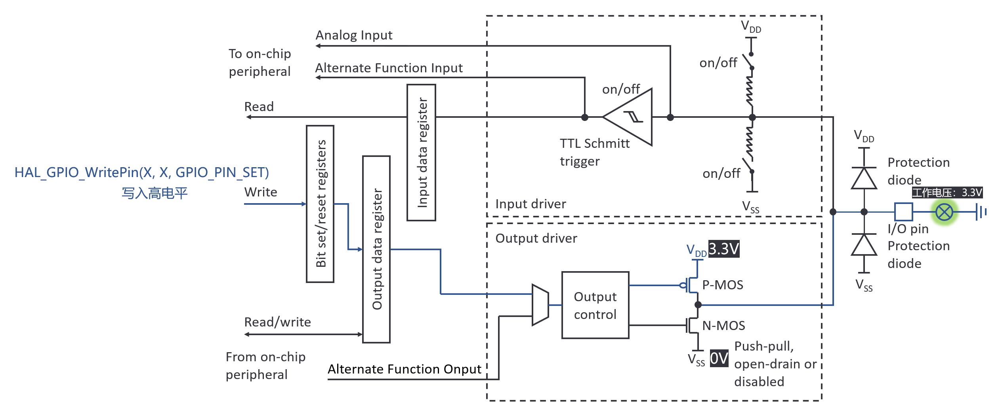{: .light}
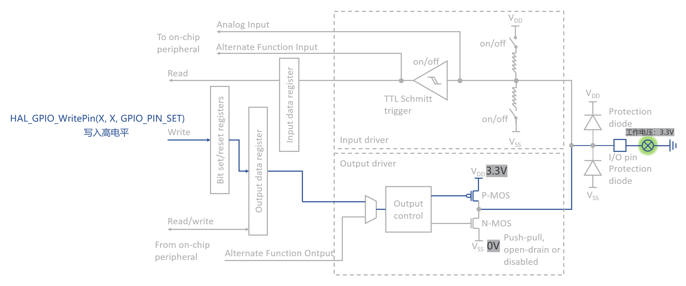{: .dark}

### 3.2 输出低电平

*   **控制信号**：”Output control“ 逻辑会给出一个使 **P-MOS截止**、**N-MOS导通** 的信号。
*   **P-MOS管**：截止，相当于一个断开的开关，与电源隔离。
*   **N-MOS管**：导通，相当于一个闭合的开关。它将输出端与 **VSS** 连接起来。
*   **结果**：输出引脚被 **主动“拉”** 到低电平（接近VSS），能够从外部的负载**吸收电流**。

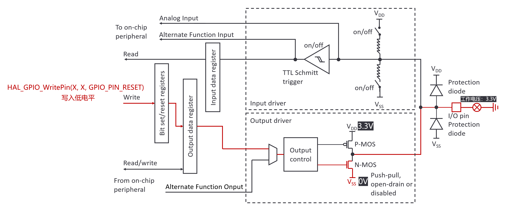{: .light}
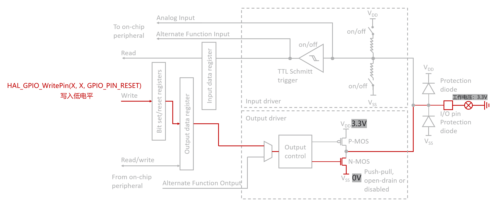{: .dark}

### 3.3 关键特点与优势

1.  **低阻抗输出**：无论在输出高电平还是低电平时，输出端都通过一个低电阻的MOS管直接连接到电源或地。这带来了两大好处：
    *   **强大的驱动能力**：可以驱动较大的电流负载（例如点亮LED、驱动继电器等）。
    *   **快速的边沿速度**：由于输出阻抗低，可以快速地对连接的电容器件（如导线寄生电容）进行充放电，使得电压上升和下降的波形非常陡峭，适合高速数字信号。

2.  **无悬空状态**：推挽输出在任何时刻都有一个确定的电平（高或低），不存在高阻抗状态。这可以有效防止因输入端悬空而引入的噪声干扰。

推挽输出虽然性能强大，但确实存在一些固有的缺点，而这些缺点恰恰就是**开漏输出**存在的理由。

### 3.4 推挽输出结构的缺点

1.  **无法兼容不同电压域**
**问题**：推挽输出的高电平电压固定为芯片本身的VDD。如果芯片工作在3.3V，其输出高电平就是3.3V。它无法与一个需要5V逻辑高电平的设备直接通信。
**原因**：上方的P-MOS管只能将输出拉到自身的VDD，无法产生一个高于VDD的电压。

2.  **不能“线与”连接**
**问题**：多个推挽输出引脚**绝对不能**直接连接在一起并试图输出不同的电平。
**原因**：如果一个输出试图驱动高电平（P-MOS导通，连接到VDD），而另一个输出试图驱动低电平（N-MOS导通，连接到GND），就会在电源（VDD）和地（GND）之间形成一个**低阻抗路径**，导致巨大的**短路电流**。这个电流足以损坏芯片。
**图解**：想象两个推挽输出直接相连：
    - 输出 A: `P-MOS ON` -> 连接到 VDD
    - 输出 B: `N-MOS ON` -> 连接到 GND
    - 结果：`VDD` → `P-MOS` → **(连接点)** → `N-MOS` → `GND`，形成电源到地的短路。

3.  **总线冲突风险**
*   在双向数据总线（如I2C、单总线）上，如果多个设备都使用推挽输出，当一台设备正在输出而另一台设备意外启动输出时，极易发生上述的短路情况，导致系统故障。

## 4. 开漏输出（Output open-drain）

开漏输出**只有下拉的N-MOS管，而没有上拉的P-MOS管**。

### 4.1 **开漏输出工作原理**
   **输出低电平**：N-MOS导通，将输出线**主动拉低**到GND。
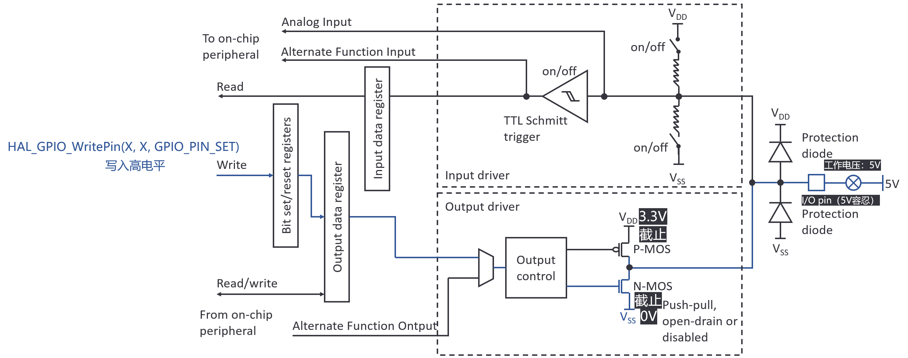{: .light}
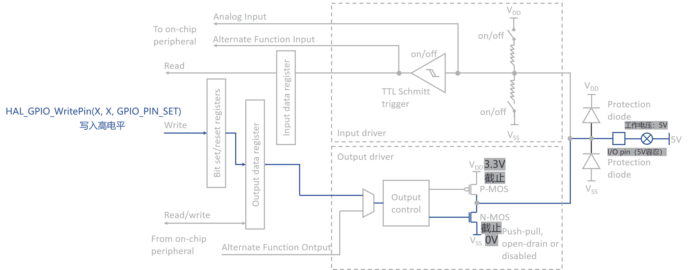{: .dark}

   **输出高电平**：N-MOS截止，输出端处于**高阻态（悬空）**。此时，输出电平由外部电路决定。
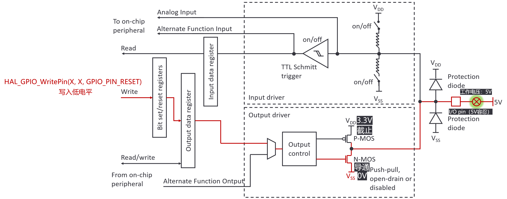{: .light}
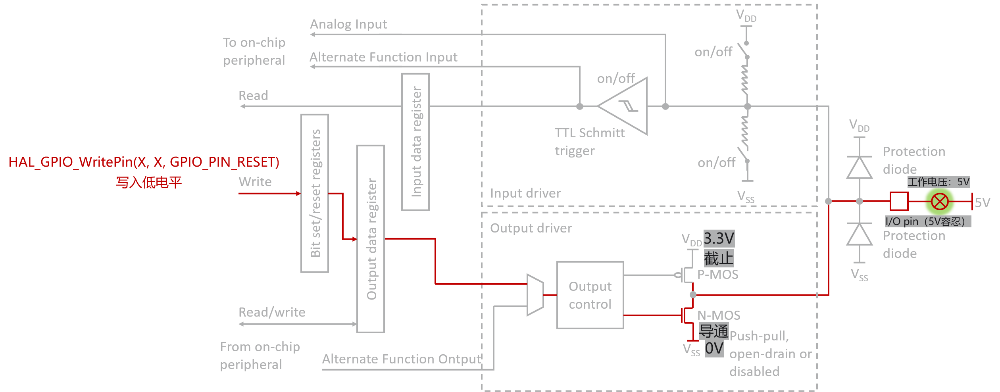{: .dark}

**开漏输出就像一个只能“关水”和“放水”的水龙头，但不能“造水”。**
   **输出低电平 = 放水**
    打开阀门，把管子里的水（电压）放掉，水位（电压）降到零。

   **输出高电平 = 关水**
    只是关上阀门，停止放水。**管子里的水从哪来？它自己不管！**
    必须外接一个“供水系统”（**上拉电阻+外部电源**）来给管子注水，水位（电压）才能升上去。

**为什么要这么设计？**

因为它安全灵活。多个这样的“水龙头”可以接到同一根管子上，不会冲突。而且你可以接一个高压“供水系统”，轻松输出比芯片自身电压还高的信号。

### 4.2 开漏输出的优势（对应推挽的缺点）

1.  **支持“线与”功能**
    - **原理**：多个开漏输出可以直接连接在一条线上（常称为“总线”）。每个输出只能主动将总线拉低，或者释放它（变为高阻态）。总线的高电平由一个**共用的上拉电阻**来建立。
    - **好处**：任何一個输出都可以通过拉低总线来代表一个信号（例如“0”），而只有当**所有**输出都释放时，总线才被上拉电阻置为高电平（代表“1”）。这在协议中非常有用，例如用于**仲裁**（多个设备谁先拉低谁赢）或**中断请求**（任何设备拉低线都表示有中断）。

2.  **轻松实现电平转换**
    - **原理**：由于输出高电平时引脚是悬空的，输出的实际高电平完全由外部上拉电阻所连接的电压（`VDD_EXT`）决定。
    - **好处**：你可以将上拉电阻接到一个5V的电源上。那么，当输出释放时，总线电平就是5V。这样，一个工作在3.3V的芯片可以轻松地与一个需要5V输入信号的设备通信，**完美解决了不同电压域器件互连的问题**，且成本极低。

3.  **减少短路风险**
    - 在总线应用中，即使两个开漏输出同时操作（一个拉低，一个试图释放），也不会形成短路路径，因为释放的一方只是断开连接，不存在将线驱动到高电平的P-MOS管。

## 5. 推挽输出与开漏输出对比
**开漏输出** 牺牲了性能（尤其是上升沿速度和驱动强度），换来了**总线功能、电平转换能力和安全性**。在像 **I2C、单总线(1-Wire)、SMBus** 等通信协议中，开漏输出是必需且不可或缺的。

### 5.1 输出高电平

| 特性         | 推挽输出                                                                             | 开漏输出                                                                  |
| :----------- | :----------------------------------------------------------------------------------- | :------------------------------------------------------------------------ |
| **工作原理** | **主动驱动**。上方的P-MOS管导通，像“推”一样，将输出端直接连接到芯片的**VDD**电源上。 | **被动释放**。下方的N-MOS管截止，输出端**悬空**。                         |
| **电流方向** | 芯片**主动向外输出电流**。                                                           | 芯片**不输出电流**，输出引脚呈高阻态。                                    |
| **最终电压** | 固定为芯片的**自身VDD**（如3.3V）。                                                  | 由**外部上拉电阻**所连接的电源电压 **VDD_EXT** 决定（可以是3.3V、5V等）。 |
| **比喻**     | **自己用力把开关推到“开”的位置。**                                                   | **自己松手，靠外部的弹簧把开关拉到“开”的位置。**                          |

### 5.2 输出低电平

| 特性         | 推挽输出                                                                         | 开漏输出                                                         |
| :----------- | :------------------------------------------------------------------------------- | :--------------------------------------------------------------- |
| **工作原理** | **主动驱动**。下方的N-MOS管导通，像“拉”一样，将输出端直接连接到芯片的**GND**上。 | **主动驱动**。下方的N-MOS管导通，将输出端连接到芯片的**GND**上。 |
| **电流方向** | 外部电流**流入引脚，被芯片吸收到地**。                                           | 外部电流**流入引脚，被芯片吸收到地**。                           |
| **最终电压** | 被强力拉低到接近**0V**。                                                         | 被强力拉低到接近**0V**。                                         |
| **比喻**     | **自己用力把开关拉到“关”的位置。**                                               | **自己用力把开关拉到“关”的位置。**                               |

### 5.3 结论

1. **输出低电平**时，**推挽**和**开漏**的行为**几乎完全相同**：都是**主动地、强力地**将输出拉至GND。
2. **关键区别在于输出高电平**：
   - **推挽**是 **“我给”** ，我主动给你一个我的VDD。
   - **开漏**是 **“我不要”** ，我放弃控制，电平多高由外部决定。

这个根本区别导致了它们在“线与”和“电平转换”能力上的巨大差异。

## 6. 什么是“复用功能”？

“复用”指的是GPIO引脚除了可以作为普通的**通用输入/输出**（由用户程序直接控制高低电平）之外，还可以被直接连接到**片上的专用外设**（如UART、SPI、I2C、定时器等）。

当引脚作为通用输出时，其输出信号来源于一个叫做 **“输出数据寄存器”** 的地方，CPU写这个寄存器来控制引脚电平。

而当引脚配置为 **“复用输出”** 时，其输出信号的来源就变了，它**直接来自于片上的外设硬件**。

## 7. 推挽复用输出

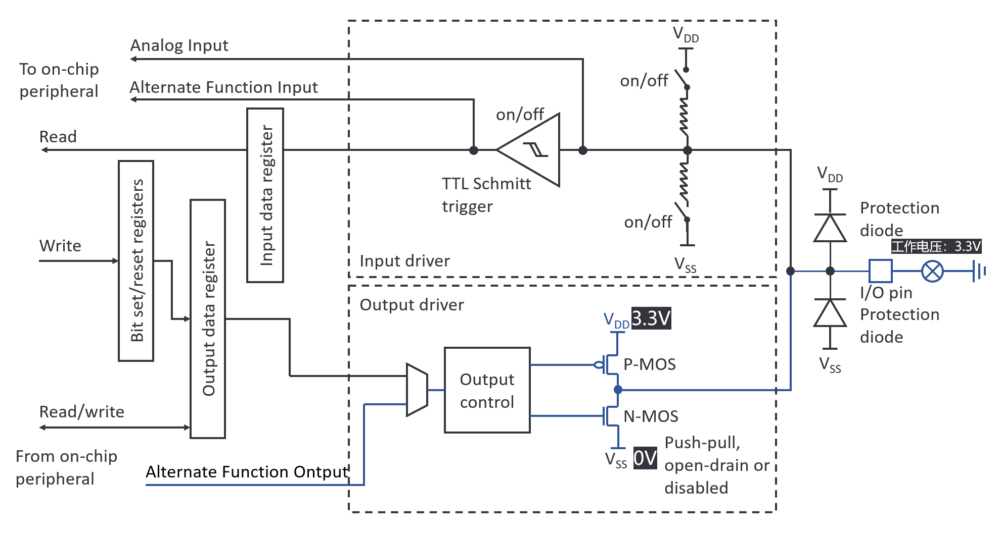{: .light}
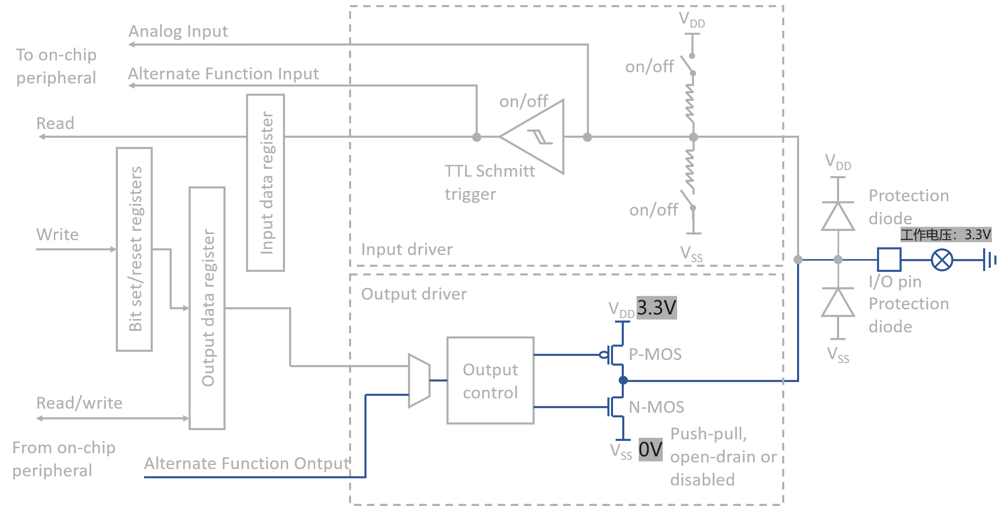{: .dark}

- **信号来源**：来自**片上外设**（如图中的“From on-chip peripheral”）。
- **输出结构**：与标准推挽输出完全相同，包含P-MOS和N-MOS组成的图腾柱。
- **工作方式**：
    - 外设硬件（如SPI的时钟线SCK）会根据其协议和配置，**自动地、高速地**控制P-MOS和N-MOS的导通与截止，从而在引脚上产生精确的波形。
    - 它依然**主动驱动**高电平和低电平。
- **典型应用**：所有需要**强驱动、高速**且**不会发生总线冲突**的数字外设。
    - **SPI** 的 SCK、MOSI、CS 引脚
    - **USART** 的 TX 引脚
    - **SDIO** 接口
    - 定时器的PWM输出通道

> **关键**：在这些应用中，通信是**点对点**的，一个输出只驱动一个（或少数几个）输入，不存在多个主设备同时驱动一条线的情况，因此可以使用高性能的推挽结构。

## 8. 开漏复用输出

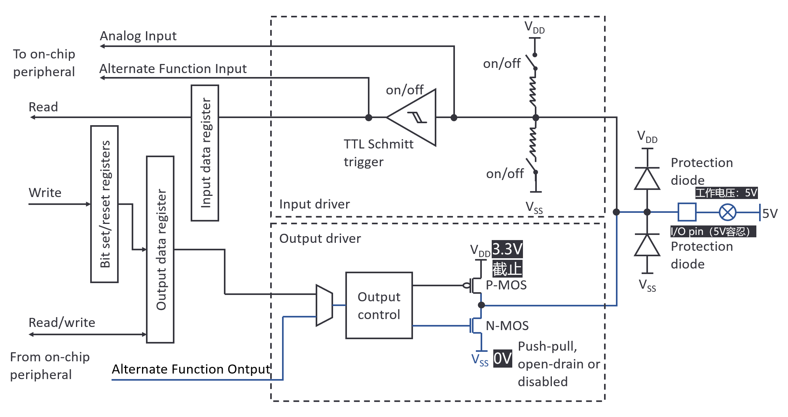{ .light}
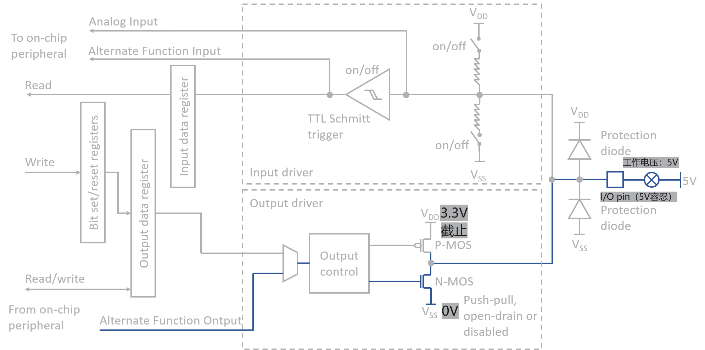{ .dark}

- **信号来源**：同样来自**片上外设**。
- **输出结构**：与标准开漏输出完全相同，**只有下拉的N-MOS，没有上拉的P-MOS**。
- **工作方式**：
    - 外设硬件通过控制N-MOS的导通与截止，来**主动拉低**或**被动释放**输出线。
    - 输出高电平依然需要**外部上拉电阻**。
- **典型应用**：所有需要 **“线与”功能、电平转换或多主设备**的总线协议。
    - **I2C** 的 SDA 和 SCL 引脚（这是最经典的例子）
    - **SMBus**
    - 某些情况下的 **CAN** 总线

> **关键**：在I2C总线上，可以有多个主设备（Master），它们的SDA和SCL引脚都必须配置为**开漏模式**。这样，任何一个设备都可以通过拉低总线来发送信号，而不会因为另一个设备同时输出高电平而造成短路。总线上的电平由上拉电阻决定，轻松实现了不同电压设备间的通信。

## 9. 推挽复用输出与开漏复用输出对比

| 模式             | 信号来源     | 输出结构 | 核心应用场景                                       |
| :--------------- | :----------- | :------- | :------------------------------------------------- |
| **推挽复用输出** | 片上外设硬件 | 推挽     | 高速、点对点、无需线与的通信（SPI, UART-TX, PWM）  |
| **开漏复用输出** | 片上外设硬件 | 开漏     | 多主设备、支持线与、需电平转换的总线（I2C, SMBus） |

**简单来说：**
“复用输出”决定了 **“谁”** 来控制引脚（是CPU还是硬件外设），而“推挽/开漏”决定了引脚 **“如何”** 输出电平（是主动推拉还是只拉不推）。这两者组合，就构成了GPIO最常用的四种输出模式，以应对不同的应用场景。

## 10. 上拉输入（Input pull-up）

**上拉输入** 是一种GPIO的配置模式，专门用于读取外部数字信号的状态。它的核心特点是：在芯片**内部**，通过一个电阻连接到电源（VDD），从而在引脚**没有外部驱动**时，为其提供一个**默认的高电平**。

这对应于 **“TTL Schmitt trigger”输入路径**，并结合了一个内部的上拉元件（通常是一个MOS管实现的电阻）。

### 10.1 工作原理与电流路径

分两种情况：当外部为高电平或悬空时、当外部为低电平时。

#### 10.1.1 当外部为高电平或悬空时

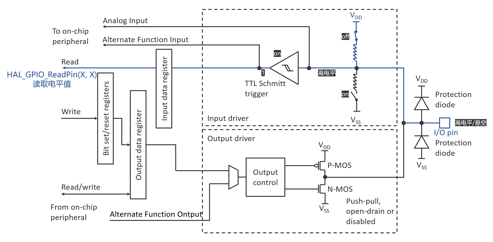{: .light}
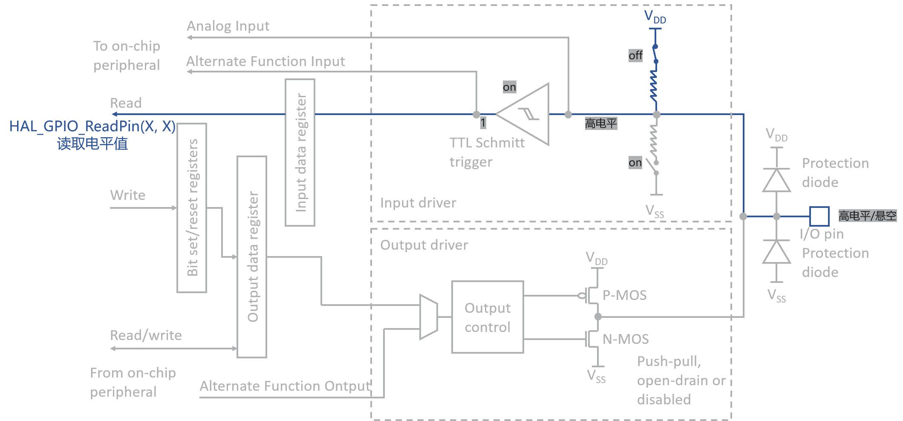{: .dark}

- **内部状态**：内部上拉电阻（例如40kΩ）连接到VDD。由于外部没有强驱动，电流路径非常微弱。
- **引脚电压**：上拉电阻将引脚电压拉至接近VDD（例如3.3V）。
- **施密特触发器**：检测到输入电压高于其上门限电压（V_T+），因此输出一个数字逻辑 **‘1’** 给内部数据寄存器。
- **电流情况**：此时几乎**没有电流**流动（只有极微弱的泄漏电流）。引脚处于高阻态，功耗极低。
- **读取操作**：当CPU读取该引脚的“输入数据寄存器”时，会得到 **‘1’**。

**简单说：外部不干预，内部电阻把引脚“默认”拉高，读到的就是1。**

#### 10.1.2 当外部为低电平时

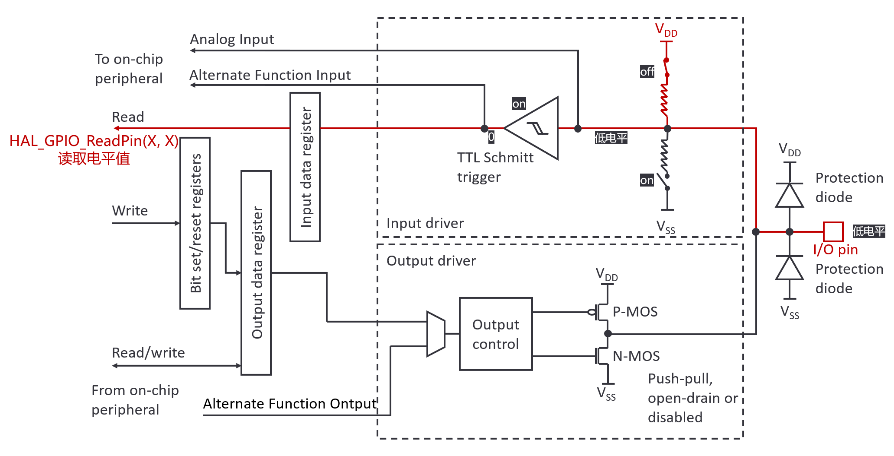{: .light}
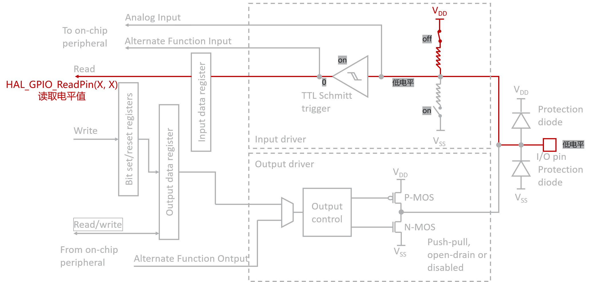{: .dark}

*   **内部状态**：外部电路（如按钮、晶体管等）将引脚强制连接到GND（地）。
*   **电流路径**：此时会形成一个明确的电流路径：**VDD → 内部上拉电阻 → 引脚 → 外部电路 → GND**。
*   **引脚电压**：由于外部是低阻抗的GND，根据欧姆定律（V = I * R），引脚电压被**强行拉低**到接近0V。
*   **施密特触发器**：检测到输入电压低于其下门限电压（V_T-），因此输出一个数字逻辑 **‘0’** 给内部数据寄存器。
*   **电流情况**：此时有持续的电流从VDD流出，经过上拉电阻，最终流入GND。这个电流被称为 **“灌电流”**。设计时需确保此电流在安全范围内（通常很小，如0.1mA）。
*   **读取操作**：当CPU读取该引脚的“输入数据寄存器”时，会得到 **‘0’**。

**简单说：外部强力拉低，电流从芯片内部VDD“流经”电阻，“灌入”外部GND，引脚被拉低，读到的就是0。**

### 10.2 **弹簧开关**

把上拉输入模式想象成一个**带有弹簧的按钮**：

*   **内部上拉电阻** = **弹簧**。它总是试图把按钮推回到“断开（高电平）”的位置。
*   **引脚** = **按钮的触点**。
*   **读取逻辑‘1’** = 检测到按钮处于**断开**状态（默认状态，弹簧起作用）。
*   **读取逻辑‘0’** = 检测到按钮被**按下**（外部力量克服了弹簧力，将触点与GND接通）。

**如果没有这个弹簧（上拉电阻）**，当按钮断开时，触点的电平是悬空、不确定的，极易受到外界噪声干扰，导致读取值在0和1之间随机跳动。上拉电阻确保了有一个**确定的默认状态**。

### 10.3 为什么需要上拉输入？

1.  **确定默认状态**：确保在输入信号悬空（如按键未按下、传感器未连接）时，微控制器能读取到一个稳定、已知的逻辑状态（通常是高电平），防止因引脚浮空引入噪声而导致逻辑错误。
2.  **用于按键检测**：这是最经典的应用。按键一端接GND，另一端接配置为上拉输入的GPIO。按键未按下时，读到1；按键按下时，读到0。
3.  **与开漏输出设备配合**：例如，与I2C设备通信时，主机的SDA和SCL引脚在作为输入时，通常需要配置为上拉输入（或者直接使用内部上拉），以便总能在总线被释放时恢复到高电平。

### 10.4 总结

| 外部状态        | 内部动作                                         | 读取值 |
| :-------------- | :----------------------------------------------- | :----- |
| **高电平/悬空** | 上拉电阻将引脚拉高                               | **1**  |
| **低电平**      | 外部将引脚拉低，电流从VDD经上拉电阻“灌”到外部GND | **0**  |

**上拉输入**模式通过一个内部电阻提供了一个默认的高电平，从而为数字输入提供了一个稳定、无噪声的读取环境，是确保数字系统可靠性的关键配置之一。

在I/O引脚被配置为数字输入模式，且输入电压处于其安全工作区之内时：**施密特触发器的输入始终是 I/O 电压。**

## 11. 下拉输入（Input-pull-down）

**下拉输入**是一种GPIO配置模式，专门用于读取外部数字信号的状态。它的核心特点是：在芯片**内部**，通过一个电阻连接到地（GND/VSS），从而在引脚**没有外部驱动**时，为其提供一个**默认的低电平**。

它与上拉输入完全相反：
- **上拉输入**：默认状态 = **高电平**
- **下拉输入**：默认状态 = **低电平**

### 11.1 工作原理与电流路径

分两种情况：当外部为高电平时、当外部为低电平或悬空时。

#### 11.1.1 当外部为高电平时

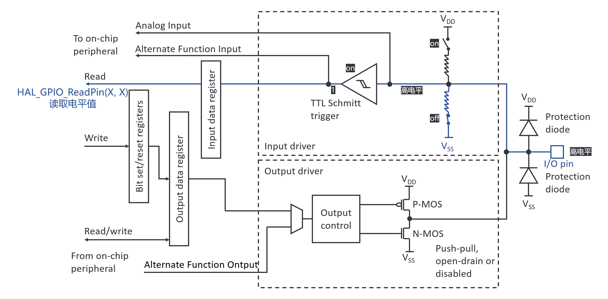{: .light}
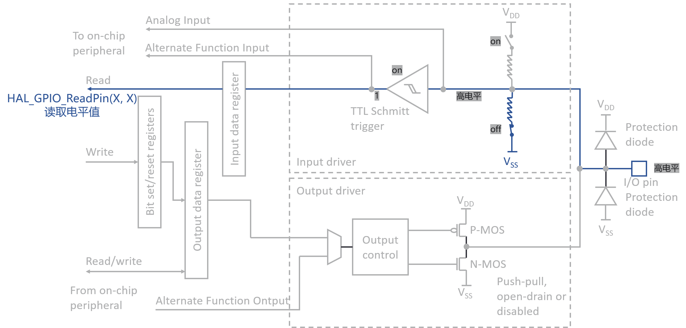{: .dark}

*   **内部状态**：外部电路（如开关、传感器等）将引脚强制连接到高电平（如VCC）。
*   **电流路径**：此时会形成一个明确的电流路径：**外部电源 → 引脚 → 内部下拉电阻 → GND**。
*   **引脚电压**：由于外部是高阻抗的电压源，引脚电压被**强行拉高**到外部电源的电压（只要该电压高于施密特触发器的V_T+）。
*   **施密特触发器**：检测到输入电压高于其上門限电压（V_T+），因此输出一个数字逻辑 **‘1’** 给内部数据寄存器。
*   **电流情况**：此时有持续的电流从外部电源流出，经过引脚，再通过内部下拉电阻流入GND。这个电流被称为 **“拉电流”**。
*   **读取操作**：当CPU读取该引脚的“输入数据寄存器”时，会得到 **‘1’**。

**简单说：外部强力拉高，电流从外部“流经”引脚，“拉出”电流后通过内部电阻到GND，引脚被拉高，读到的就是1。**

#### 11.1.2 当外部为低电平或悬空时

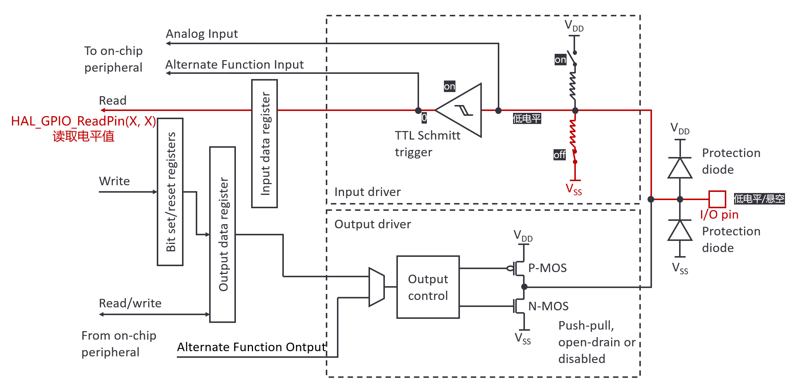{: .light}
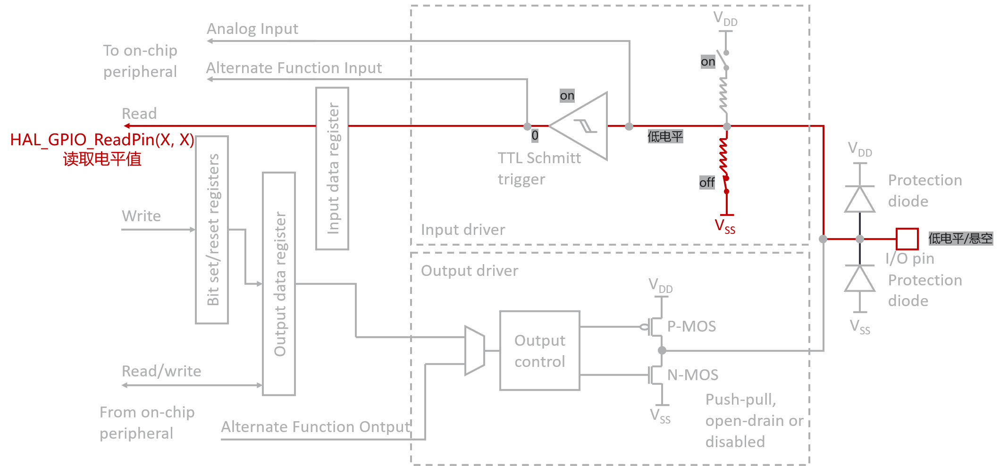{: .dark}

*   **内部状态**：内部下拉电阻（例如40kΩ）连接到GND。由于外部没有强驱动，电流路径非常微弱。
*   **引脚电压**：下拉电阻将引脚电压拉至接近0V（GND）。
*   **施密特触发器**：检测到输入电压低于其下门限电压（V_T-），因此输出一个数字逻辑 **‘0’** 给内部数据寄存器。
*   **电流情况**：此时几乎**没有电流**流动。引脚处于高阻态，功耗极低。
*   **读取操作**：当CPU读取该引脚的“输入数据寄存器”时，会得到 **‘0’**。

**简单说：外部不干预，内部电阻把引脚“默认”拉低，读到的就是0。**

### 11.2 *重力开关**

延续之前的比喻，您可以把下拉输入模式想象成一个**带有重力的按钮**：

*   **内部下拉电阻** = **重力**。它总是试图把按钮拉回到“闭合（低电平）”的位置。
*   **引脚** = **按钮的触点**。
*   **读取逻辑‘0’** = 检测到按钮处于**自然下垂的闭合**状态（默认状态，重力起作用）。
*   **读取逻辑‘1’** = 检测到按钮被**提起**（外部力量克服了重力，将触点断开并与高电平接通）。

**如果没有这个重力（下拉电阻）**，当按钮未被提起时，触点的电平是悬空、不确定的。

### 11.3 为什么需要下拉输入？

1.  **确定默认状态**：确保在输入信号悬空时，微控制器能读取到一个稳定、已知的**低电平**逻辑状态。这对于**低电平有效**的使能信号、复位信号或检测开关闭合到VCC的场景至关重要。
2.  **防止悬空引脚噪声**：和上拉一样，提供一个确定的路径，防止引脚浮空引入噪声。
3.  **特定应用场景**：
    *   **检测高电平触发事件**：当您需要知道一个信号何时变为高电平时（如，一个开关将引脚连接到VCC）。
    *   **与特定传感器接口**：有些传感器的输出在空闲时为高阻态，需要下拉电阻来确保空闲时读到低电平。

## 12. 上拉输入与下拉输入的对比

| 特性                   | 上拉输入               | 下拉输入               |
| :--------------------- | :--------------------- | :--------------------- |
| **内部连接**           | 电阻连接到 **VDD**     | 电阻连接到 **GND**     |
| **默认状态（悬空时）** | **高电平 ('1')**       | **低电平 ('0')**       |
| **外部驱动为高**       | 读到 '1'，有**灌电流** | 读到 '1'，有**拉电流** |
| **外部驱动为低**       | 读到 '0'，有**灌电流** | 读到 '0'，有**拉电流** |
| **典型应用**           | 按键另一端接GND        | 按键另一端接VCC        |

**下拉输入**模式通过一个内部电阻提供了一个默认的低电平，是上拉输入的完美互补，为数字输入提供了另一种确定性的默认状态，同样是确保数字系统可靠性的关键配置。

## 13. 浮空输入（Input floating）

**浮空输入**，也称为**高阻输入**，是一种GPIO配置模式。在此模式下，芯片内部**既没有**上拉电阻连接到VDD，**也没有**下拉电阻连接到GND。

引脚在电气上与任何确定的电压源都是**断开**的，完全依赖于**外部电路**来提供明确的电平信号。

### 13.1 工作原理：完全依赖外部

浮空输入可以看作是上拉/下拉输入模式的“空白”版本。

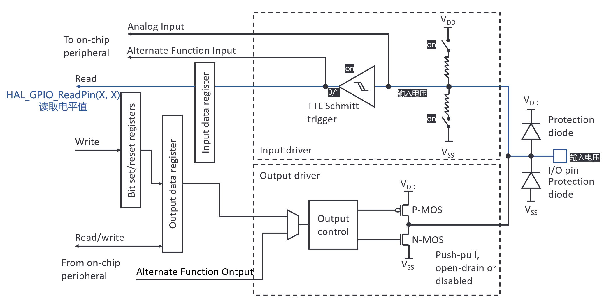{: .light}
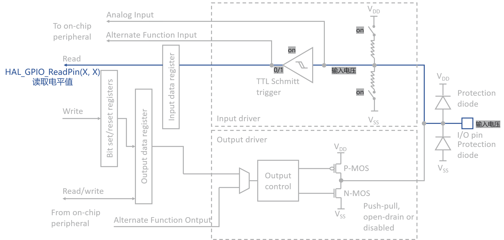{: .dark}

- **内部状态**：引脚直接连接到施密特触发器的输入端，内部没有任何有源器件为其提供默认电平。
- **引脚电压**：在没有外部驱动时，引脚处于**高阻态**，其电压是**不确定的（悬浮的）**。它极易受到周围电磁环境的干扰，电压值会漂浮不定。
- **读取操作**：CPU读取“输入数据寄存器”时，得到的值就是这个不确定的、漂浮的电压经过施密特触发器判断后的结果，因此读到的值会在 `0` 和 `1` 之间**随机跳动**。

### 13.2 **空载的天平**

*   **上拉输入**：像一个向一侧倾斜的天平（默认倾向“1”）。
*   **下拉输入**：像一个向另一侧倾斜的天平（默认倾向“0”）。
*   **浮空输入**：像一个**完全平衡、且没有负载的空天平**。

这个空天平对任何微小的力量都极其敏感：
*   一阵微风（**环境噪声**）就可能让它向左或向右倾斜。
*   只有当你施加一个**明确、稳定**的外力（**外部驱动信号**），它才会稳定地指向一边。

### 13.3 为什么需要浮空输入？

既然它如此不稳定，为什么还要存在？因为它对于某些特定的、需要“纯粹”读取外部电压的场景是必需的。

1.  **连接外部模拟信号（用于ADC）**
    这是最重要也是最常见的应用。当您需要将一个模拟电压（如来自温度传感器、麦克风、电位器的信号）输入到芯片内部的**模数转换器（ADC）** 时，**必须**将引脚配置为浮空输入。
    *   **原因**：任何内部的上拉或下拉电阻都会形成一个分压电路，**严重干扰甚至改变**您要测量的外部模拟电压的准确性，导致ADC读数完全错误。浮空输入确保了外部电压能被“原汁原味”地读取。

2.  **连接外部驱动能力很强的数字信号**
    当外部信号源本身是推挽输出，且驱动能力很强（例如，另一个MCU的输出、专用的电平转换芯片、逻辑门芯片等），它可以提供稳定可靠的 `0` 或 `1` 电平时，使用浮空输入是完全可以的，并且可以节省一点点功耗（因为没有内部电阻在持续消耗电流）。

3.  **通信协议中的双向数据线（特殊配置）**
    在某些情况下，一个引脚需要在输入和输出模式间快速切换。当它切换到输入模式时，通常会设置为浮空输入，以避免内部电阻影响总线的电平。

**浮空输入**模式将引脚的控制权完全交给了外部电路。它是在需要读取**模拟信号**或外部**强驱动数字信号**时的正确选择。在绝大多数纯数字输入的应用中（如按键检测），如果不使用浮空输入，**必须**在外部添加上拉或下拉电阻，否则系统将因为引脚悬空而工作不稳定。

浮空输入模式时，施密特触发器的输入电压就是I/O引脚上的电压，而且这是一种 “最直接、最未经处理” 的连接。

在数字电路设计中，一个黄金法则是：**任何一个输入引脚都不能处于浮空状态，除非你明确知道自己在做什么（比如连接ADC）**。 否则，必须通过内部或外部的上拉/下拉电阻为其提供一个确定的默认状态。

## 14. 模拟输入（Analog）

对应于最左侧的 **“Analog Input”** 路径，这条路径完全绕开了我们之前讨论的所有数字逻辑部分。

**模拟输入** 是一种GPIO配置模式，用于将引脚内部直接连接到芯片的**模数转换器（ADC）** 或其他模拟外设（如比较器）。在此模式下，引脚与**所有数字电路部分完全断开**，成为一个纯粹的模拟信号采样点。

在绝大多数微控制器的模拟输入模式下，内部的**上拉和下拉电阻开关会被强制断开（禁用）。**

它的核心目标是：**尽可能准确地将外部真实的物理世界电压值（模拟信号）无损地传递给ADC。**

### 14.1 工作原理

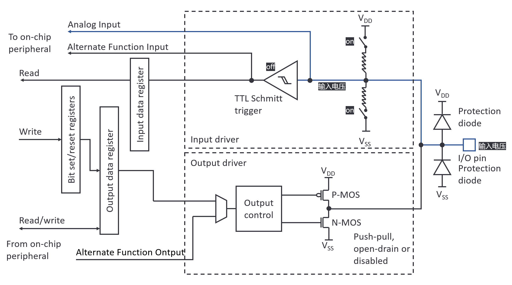{: .light}
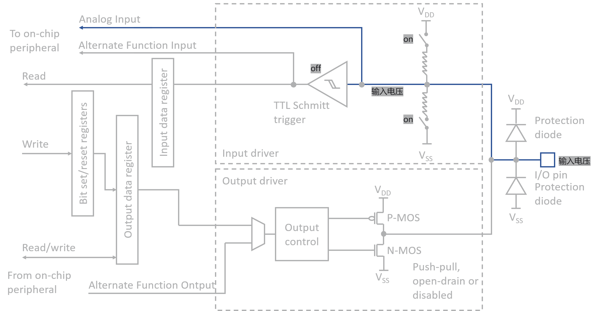{: .dark}

- 芯片内部通过一个**物理开关**，将引脚从数字输入路径（施密特触发器）上**彻底断开**。
- 引脚被直接切换到一个**高阻抗、高精度的模拟采样电路**，并连接到ADC的输入端。
- **结果**：外部模拟电压信号可以“安静”地进入ADC，完全不受数字电路的噪声、阈值和逻辑判断的干扰。

**这个模式下，CPU无法通过读取“输入数据寄存器”来得到一个数字的0或1，而是必须通过ADC外设来读取一个代表电压值的数字量（如0-4095）。**

### 14.2 为什么需要模拟输入？

1.  **保证采样精度**：这是最主要的原因。数字电路（尤其是快速翻转的逻辑门）会产生高频开关噪声。如果模拟信号和数字信号在芯片内部靠得太近，这种噪声会耦合到模拟信号中，导致ADC的测量结果严重失真、跳动。断开连接是根本的解决方案。

2.  **减少功耗和泄漏**：断开与数字电路的连接，也断开了可能存在的泄漏电流路径，使得采样点的阻抗更高，对被测信号的影响更小。

3.  **兼容模拟外设**：除了ADC，引脚还可以被切换到芯片内部的**模拟比较器**、运算放大器等其他模拟外设的正/负输入端，这些都要求信号是纯净的模拟形式。

### 14.3 关键特性总结

| 特性               | 模拟输入                                                             |
| :----------------- | :------------------------------------------------------------------- |
| **内部连接**       | 直接连接到 **ADC** 或 **模拟比较器**                                 |
| **与数字电路关系** | **完全物理断开**（禁用数字输入功能）                                 |
| **引脚状态**       | **极高阻抗**，纯粹的采样点                                           |
| **读取方式**       | 必须通过 **ADC** 读取转换后的数字值，**不能**读取GPIO数据寄存器      |
| **核心应用**       | 连接各类模拟传感器（温度、光照、压力、音频）、电位器、电池电压检测等 |

### 14.4 总结

**模拟输入**是MCU连接物理世界的桥梁。它通过牺牲所有的数字输入功能，换取了最高的信号采样保真度。当您需要测量一个连续的电压值（而不仅仅是判断高低电平）时，就必须将引脚配置为模拟输入模式。

## 15. REFERENCES
1. STM32 参考手册
2. [【STM32入门教程-2024】第5集 关于STM32 GPIO内部的那些事】](https://www.bilibili.com/video/BV1zG4y1K78S/?share_source=copy_web&vd_source=54da364394d3171749b2e716a4ee75dd)
