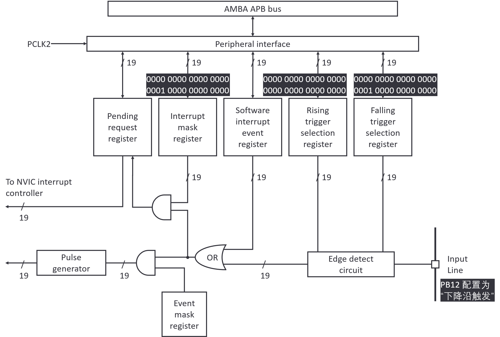
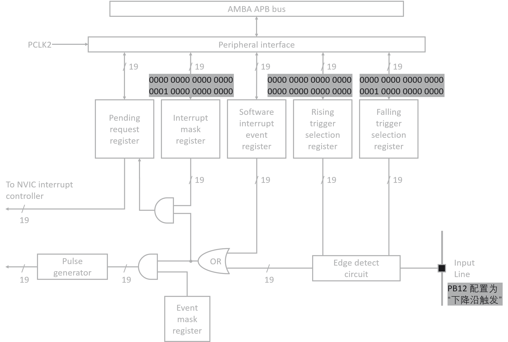
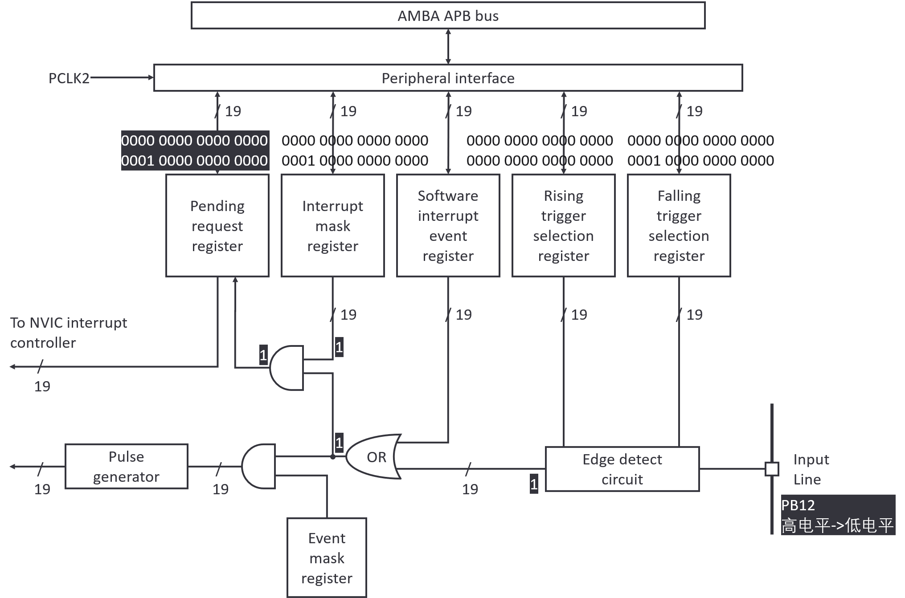
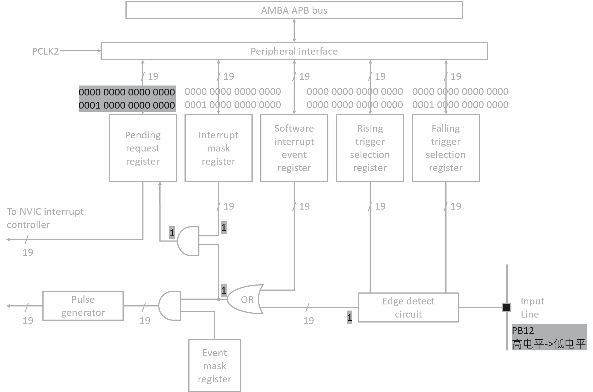

## 中断配置

当将STM32的引脚 **PB12** 配置为 **“外部中断模式，下降沿触发”** 时，芯片内部的**外部中断/事件控制器** 会进行一系列设置。

信号路径为：**GPIO Pin (PB12) -> Edge Detect Circuit -> NVIC -> CPU**

{: .light}
{: .dark}

### 下降沿触发选择寄存器（Falling trigger selection register）

配置后**第一个直接受到影响**的寄存器。

*   **作用**：这个寄存器用于**启用**对应引脚线的**下降沿检测**功能。
*   **将该寄存器的第12位（对应EXTI12）设置为‘1’**，EXTI 控制器正式“监听” PB12 引脚上的**下降沿**信号。(0000 0000 0000 0000 0000 0001 0000 0000 0000  = 0x00001000)

### 上升沿触发寄存器（Rising trigger selection register）

上升沿触发寄存器与下降沿触发寄存器是互斥的，用于配置上升沿触发。

*   **作用**：**启用**对应引脚线的**上升沿检测**功能。
*   **将该寄存器的第12位（对应EXTI12）明确地设置为‘0’**，EXTI控制器**忽略** PB12 引脚上的任何上升沿信号。这确保了中断触发条件的纯粹性。(0000 0000 0000 0000 0000 0000 0000 0000  = 0x00000000  )

### 边沿检测电路（Edge detect circuit）

此为硬件电路，而不是一个软件可配置的寄存器。它负责实际检测引脚上的电平变化。

*   **作用**：实时监控 GPIO 引脚的电平。当它检测到符合 `Rising/Falling trigger selection register` 所设置条件的边沿事件时，就会产生一个信号。
1.  该电路会持续采样PB12引脚的电平。
2.  当 PB12 引脚的电平从**高电平（1）** 变为**低电平（0）** 时，电路会检测到这个**下降沿**。
3.  由于 `Falling trigger selection register` 已经使能，这个下降沿事件被认为是有效的。
4.  检测到有效下降沿后，该电路会做两件事：
    *   **置位中断挂起寄存器**：它将 `Pending request register` 的第12位置‘1’。这个标志位表示“有一个EXTI12 的中断正在等待处理”。这个寄存器就像是一个标志，告诉 NVIC 有中断来了。
    *   **向NVIC发送中断请求**：如果中断没有被屏蔽，这个请求会继续向上传递到 NVIC。

### 中断屏蔽寄存器（Interrupt mask register）

将其第 12 位 设置为 1。这相当于打开了一个允许开关，让 EXTI12 的中断请求能够通过，并继续向 NVIC 传递。(0000 0000 0000 0000 0001 0000 0000 0000  = 0x00001000)

## 中断发生

{: .light}
{: .dark}

当 **PB12 被设置为下降沿触发**后，**PB12 由高电平变为低电平**时，芯片内部发生的具体事件。

### Edge detect circuit (边沿检测电路)
*   这个硬件电路持续监测着 PB12（即 EXTI12 线）上的电平。
*   当它检测到电平从**高** 变为**低** 时，它立即识别到一个**下降沿**。

### Falling trigger selection register (下降沿触发选择寄存器)
*   边沿检测电路会来“查询”这个寄存器的配置。它发现该寄存器的**第12位是1**。
*   这意味着刚才检测到的下降沿是一个**有效事件**，需要被处理。

### Pending request register (挂起请求寄存器)
*   一旦边沿检测电路确认了有效事件，它会**自动将 Pending request register 的第12位置为1**。
*   **这个动作至关重要！** 这一位就像一个“标志旗”，升起来表示：“喂，有一个EXTI12的中断正在这里等着处理呢！”只要这一位是1，EXTI控制器就会认为有一个中断请求持续存在。

### Interrupt mask register (中断屏蔽寄存器)
*   中断信号在继续向上传递之前，会经过一个“门卫”，也就是中断屏蔽寄存器。
*   因为之前已经将它的**第12位设置为1**，这个“门卫”会放行这个中断请求。

### 至 NVIC 中断控制器
*   中断请求成功通过“门卫”，被发送到**NVIC**。
*   NVIC 是 CPU 的“中断调度中心”。它根据优先级等因素，最终决定在何时让 CPU 来响应这个中断。
*   CPU 会跳转到事先写好的**中断服务函数**（`EXTI15_10_IRQHandler`）中执行代码。

1.  **关键清理阶段（在中断服务函数中）**

    *   当你处理完中断后，**必须手动清除挂起标志位**，否则CPU会认为中断一直存在，导致无限重复进入中断函数。
    *   你需要在代码中向 `Pending request register` 的**第12位写入一个‘1’**（`HAL_GPIO_EXTI_IRQHandler`），以此来清除它（将其清零）。这个“写1清零”的机制非常常见。

## REFERENCES
1. STM32 参考手册
2. [【keysking的STM32教程】 第7集 深入讲解STM32中断】](https://www.bilibili.com/video/BV1M24y1473t/?share_source=copy_web&vd_source=54da364394d3171749b2e716a4ee75dd)
