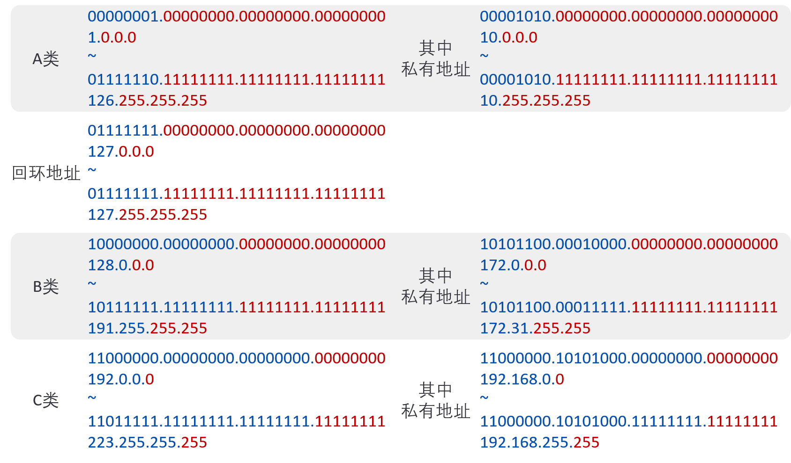
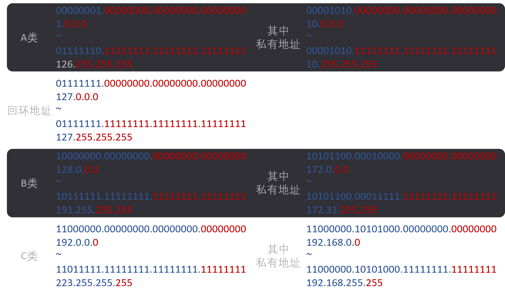
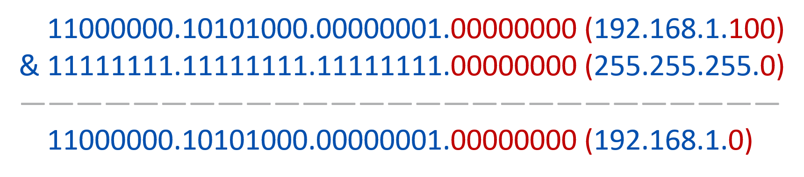
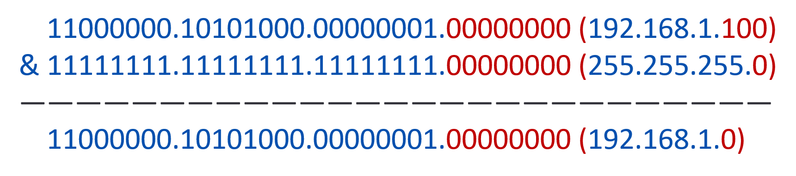

**IP地址（Internet Protocol Address）**是互联网中设备的**逻辑标识**，用于**跨网络定位和通信**，是TCP/IP协议栈的核心组成部分。

## 1. IP地址的由来
互联难题：不同网络（如局域网、广域网）的设备需要统一的标识规则才能通信。  

1981年，IETF（互联网工程任务组）发布**RFC 791**，定义了IPv4（网际协议版本4）地址规范，通过32位二进制数为每个网络设备分配唯一逻辑地址，解决了跨网络定位问题。  

随着互联网设备爆发式增长，32位IPv4地址（约43亿个）逐渐耗尽，1998年IETF推出**IPv6**（128位地址，理论上可提供约3.4×10³⁸个地址），目前正逐步替代IPv4。

## 2. IP地址的结构与表示方式
### 2.1 IPv4地址
- **二进制本质**：32位二进制数（如 `11000000.10101000.00000001.00000001`）。  
- **人类可读格式**：点分十进制（将32位分为4组8位二进制，每组转换为0-255的十进制数，用圆点分隔），例如 `192.168.1.1`。  

### 2.2 IPv6地址
- **二进制本质**：128位二进制数，容量远超IPv4。  
- **人类可读格式**：冒分十六进制（分为8组4位十六进制数，用冒号分隔），例如 `2001:0db8:85a3:0000:0000:8a2e:0370:7334`。为简化书写，可省略连续的0组，用双冒号 `::` 代替（如 `2001:db8:85a3::8a2e:370:7334`）。

### 2.3 IP地址的类型（以IPv4为例）
根据网络规模和用途，IPv4地址分为以下类型：
1. **A类地址**  
   - 范围：`1.0.0.0 ~ 126.255.255.255`（第1位为0）。  
   - 用途：大型网络，默认前8位为网络号，后24位为主机号，支持约1600万台主机。  

2. **B类地址**  
   - 范围：`128.0.0.0 ~ 191.255.255.255`（前2位为10）。  
   - 用途：中型网络，默认前16位为网络号，后16位为主机号，支持约6.5万台主机。  

3. **C类地址**  
   - 范围：`192.0.0.0 ~ 223.255.255.255`（前3位为110）。  
   - 用途：小型网络，默认前24位为网络号，后8位为主机号，支持254台主机。  

| 地址类别 | 地址范围                | 二进制前缀 | 默认网络号位数 | 默认主机号位数 | 支持最大主机数 | 核心用途/说明                                                                 |
|----------|-------------------------|------------|----------------|----------------|----------------|-------------------------------------------------------------------------------|
| A类地址  | 1.0.0.0 ~ 126.255.255.255 | 0          | 8位            | 24位           | 约1600万       | 用于大型网络，如早期的互联网主干网、大型企业或机构网络                         |
| B类地址  | 128.0.0.0 ~ 191.255.255.255 | 10         | 16位           | 16位           | 约6.5万        | 用于中型网络，如中等规模企业、高校或城市级网络                                 |
| C类地址  | 192.0.0.0 ~ 223.255.255.255 | 110        | 24位           | 8位            | 254台          | 用于小型网络，如家庭局域网、小型办公室网络（主机号全0和全1不可用，故为2^8-2=254） |

4. **特殊地址**  
   - 广播地址：主机号全为1（如 `192.168.1.255`），用于向本网段所有设备发送数据。  
   - 网络地址：主机号全为0（如 `192.168.1.0`），标识网络本身。  
   - 回环地址：`127.0.0.1`，用于本地设备自我测试。  
   - 私有地址：仅局域网内使用，不接入互联网，如 `10.x.x.x`、`192.168.x.x`。  

| 特殊地址类型 | 地址格式/范围                          | 关键特征                | 核心用途                                                                 | 示例                  |
|--------------|----------------------------------------|-------------------------|--------------------------------------------------------------------------|-----------------------|
| 广播地址     | 对应网段的“网络号 + 全1主机号”         | 主机号部分二进制全为1   | 向同一网段内**所有设备**发送数据，实现“一对多”通信（如局域网内批量通知） | 192.168.1.255、10.0.0.255 |
| 网络地址     | 对应网段的“网络号 + 全0主机号”         | 主机号部分二进制全为0   | 标识一个网络本身，不分配给具体设备，仅用于路由判断和网络标识             | 192.168.1.0、10.0.0.0     |
| 回环地址     | 127.0.0.1 ~ 127.255.255.254            | 首段固定为127           | 本地设备自我测试（如验证网卡、调试网络程序），数据不经过物理网卡         | 127.0.0.1（最常用）        |
| 私有地址     | 1. 10.0.0.0 ~ 10.255.255.255 2. 172.16.0.0 ~ 172.31.255.255 3. 192.168.0.0 ~ 192.168.255.255 | 仅在局域网内生效，不接入公网 | 解决公网IP地址不足问题，局域网设备通过NAT（网络地址转换）访问互联网     | 192.168.1.100、10.1.2.3    |

{: .light}
{: .dark}

### 2.4 子网掩码：划分网络与主机的边界
#### 2.4.1 作用
子网掩码是32位二进制数，与IP地址配合使用，**区分IP地址中的“网络号”和“主机号”**，实现网络细分（子网划分），提高地址利用率。

#### 2.4.2 规则
- 子网掩码中，`1` 对应IP地址的“网络号”部分，`0` 对应“主机号”部分。  
- 例如：IP地址 `192.168.1.100` 与子网掩码 `255.255.255.0`（二进制 `11111111.11111111.11111111.00000000`）结合，可知前24位为网络号（`192.168.1`），后8位为主机号（`100`）。

#### 2.4.3 表示方式
- 点分十进制：如 `255.255.255.0`。  
- CIDR前缀（无类别域间路由）：用 `/n` 表示前n位为网络号，如 `192.168.1.100/24` 等价于子网掩码 `255.255.255.0`。

{: .dark}
{: .light}

### 2.5 IP地址与MAC地址的配合
IP地址和MAC地址分工协作：  
- **IP地址**：负责跨网络定位（如从北京的设备访问上海的服务器），通过路由器转发。  
- **MAC地址**：负责局域网内通信（如同一WiFi下的手机和电脑），通过交换机转发。  
数据传输时，先通过IP地址找到目标网络，再通过ARP协议将IP地址转换为MAC地址，最终送达设备。
